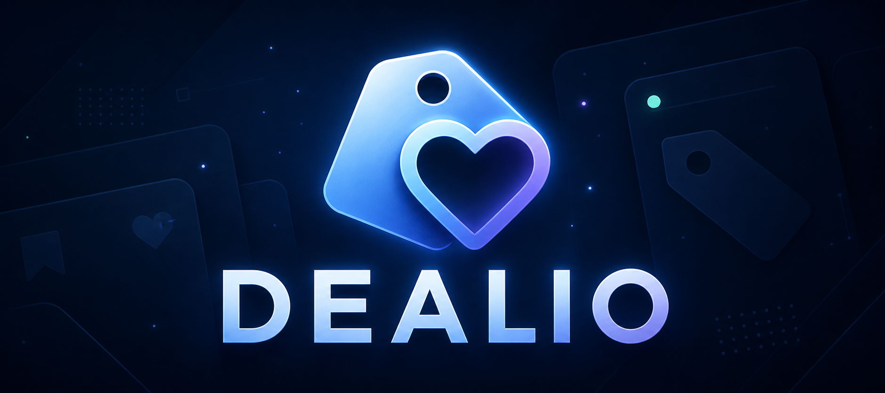
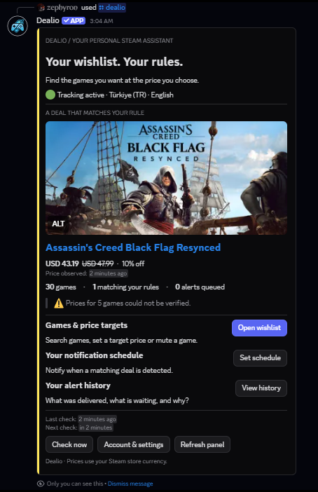
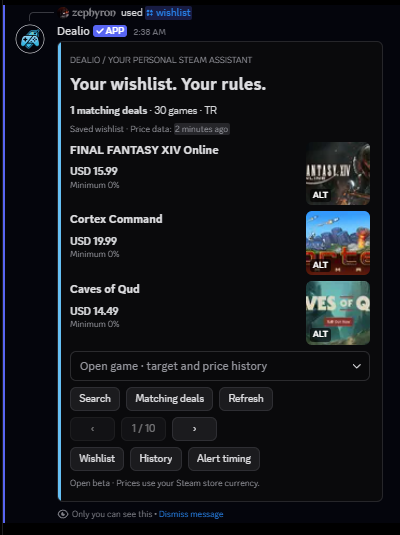
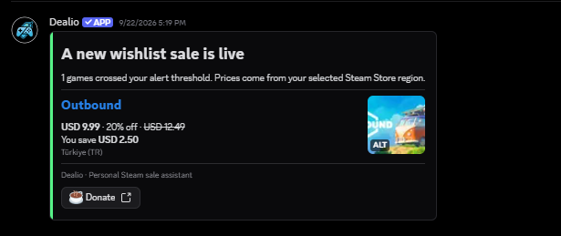

  

<h1 align="center">🎮 Your wishlist. Your rules.</h1>

  A personal Steam price assistant, right inside Discord. 
  Pick your price. Choose when to hear about it. Let Dealio keep watch.

  
  
  

  
  
  

  
  
  

---

## 🎮 Less checking. More playing.

There's a game on your Steam wishlist, but the price isn't quite right. Tell Dealio what you'd like to pay. It checks Steam at regular intervals and sends you a Discord DM when your rule is met.

Set a different target for each game, or use one discount threshold across your list. Choose quiet hours if you don't want late-night notifications. To browse your games or change a setting, just open `/dealio`.

| 🎯 Your price | 🔕 Your schedule | 📊 Your context |
| :--- | :--- | :--- |
| Set a target price or a discount threshold for each game. Mute the games you want to skip. | Get alerts when detected, hold them during quiet hours, or choose a daily digest. | See Steam's regional currency, recent observed prices, and the reason behind an alert. |

## 👀 A look inside Discord

<table>
  <tr>
    <td width="50%" valign="top"><strong>🏠 Dealio · your home panel</strong>  </td>
    <td width="50%" valign="top"><strong>🎮 Wishlist · games and price rules</strong>    <strong>📬 A sale alert in your DMs</strong>  </td>
  </tr>
</table>

Real Discord screenshots shared by the user, with English UI. The DM is an example from 22 September 2026; prices and some interface details may differ from the current version.

### ✨ What's inside?

- 🏠 **One place to start.** Game artwork, matching deals, notification settings, and history.
- 🎮 **A list you can browse.** Search, filter, move through three-game pages, or open a game's details.
- 🎯 **A choice for each game.** Use your default discount threshold, set a different percentage, or enter a target price. Mute games you want to skip.
- 📬 **A record of your alerts.** See pending and sent DMs, and try a test message if delivery isn't working. A delivery record doesn't mean the message was read.
- 📊 **Prices over time.** Dealio keeps its own observations for 90 days. Newly tracked games may have little history; these records don't establish an all-time low.
- 🌍 **Turkish, English, German and French.** Every language covers setup, menus, and notifications, written in a friendly first-person voice and using Steam’s own words for the wishlist in each language. German and French are new and have not had real-user trials yet.

## ✨ Latest updates

> **30 September 2026 · Limited beta, first users**
>
> Three desktop users completed setup with the Türkiye store and Turkish menus. They reported no problems with the commands they tried. We're now watching how notifications hold up in everyday use.

This release brings together the notification reliability work and beta preparations. [Read the v0.1.0-beta.1 notes →](https://github.com/blghnboz17-boop/steam-wishlist-discord-bot/releases/tag/v0.1.0-beta.1)

## 🚀 Start in Discord

Dealio is being tested with a small group. If you'd like to join, get in touch through the [beta page](https://blghnboz17-boop.github.io/dealio-public-pages/index-en.html). It's free to use; the general invite will open after acceptance testing.

1. **Join a server with the bot.** We'll share access details when you join the beta.
2. **Run `/setup`.** Enter your SteamID64 or profile link, confirm your Steam Store country and language, then explicitly enable sale DMs.
3. **Open `/dealio`.** Browse your wishlist, choose a game, and set the price you want.

Your Steam wishlist must be publicly readable, and Discord must allow DMs from the bot. Dealio does not ask for a Steam password, cookie, or login session.

## 🔔 When will I hear from Dealio?

Dealio checks again **30 minutes after each scan finishes**. When a price change meets your rule, it sends a DM according to your notification schedule. Steam or Discord issues can add delay.

Initial setup may send a summary of existing discounts, rather than a new-sale alert for each one. Saving a target that the current price already meets won't trigger an immediate DM either. Prices use your selected Steam Store currency; check the final price on Steam before buying.

## 💬 Commands

| Command | Purpose |
| :--- | :--- |
| `/dealio` | Your home: deals, tracking, and personal controls |
| `/setup` | Connect your Steam profile and choose your preferences |
| `/wishlist` | Browse, search, set targets, mute games, and inspect price observations |
| `/status` | Account settings, global discount threshold, and notification status |
| `/check` | Request a check, subject to a short cooldown |
| `/region` | Choose your Steam Store country |
| `/test-notification` | Send yourself a test alert built from a game currently on sale on your wishlist |
| `/delete-data` | Delete your active account data after confirmation |

Panels are private and bound to the person who opened them. After a timeout or bot restart, open a fresh command to continue.

## 🧪 Beta status

Three users reported successful Turkish desktop setup and command trials. We're now working through at least seven days of real-world use. English, mobile, and longer-running delivery checks remain on the list before the general invite opens.

## 🔒 Privacy & control

Dealio stores your account identifiers, preferences, game rules, observed wishlist prices, and delivery records. It does not collect ordinary Discord message content or Steam credentials.

Notification history displays the last **30 days**; price observations are retained for **90 days**. Active deliveries and ongoing-offer deduplication records may be kept longer. `/delete-data` removes active account records; existing backup copies are not rewritten by that command.

[Privacy](https://blghnboz17-boop.github.io/dealio-public-pages/privacy.html) · [Terms](https://blghnboz17-boop.github.io/dealio-public-pages/terms.html) · [Help](https://blghnboz17-boop.github.io/dealio-public-pages/help.html)

## ❓ A few useful answers

<strong>What can I do if I get a “Failed” error?</strong>

That message alone doesn't tell us the cause, and it doesn't necessarily mean you did anything wrong. Steam may not have returned prices, Discord may not have completed an action, or something may have gone wrong inside Dealio. Any extra detail in the message helps narrow it down.

Give it a moment, then try the command once more. If a cooldown is shown, wait for it to finish. If an old panel's button isn't working, open a fresh panel with `/dealio`. Still stuck? Use the [help page](https://blghnboz17-boop.github.io/dealio-public-pages/help.html) to share the command, approximate time, and error text. Hide personal details in screenshots; you don't need to delete your setup and start over as a first step.

<strong>The bot works, but I'm not getting DMs. What should I check?</strong>

Start with `/test-notification`. If the sample doesn't arrive either, check that you haven't blocked the bot and that you allow DMs from your shared server. If alerts were paused because DMs were blocked, re-enable them in `/dealio` → ⚙️ Settings after fixing the setting.

If the test arrives but a sale alert doesn't, check your notification status in `/dealio` → ⚙️ Settings, the game's target or discount threshold, its mute setting, and your quiet hours or daily digest. A test DM confirms you can receive messages; it doesn't mean every game currently qualifies for an alert.

<strong>My Steam profile was found, but my wishlist won't load. Why?</strong>

Check that the profile link is correct and your wishlist is visible to other people. Try opening your wishlist link in a browser window where you aren't signed into Steam; being able to see your profile alone may not be enough.

If you've just changed your Steam privacy settings, give it a moment and try again. If the list opens while signed out but Dealio still can't read it, Steam may be temporarily unavailable. If another attempt doesn't help, [let us know](https://blghnboz17-boop.github.io/dealio-public-pages/help.html). Please don't share your Steam password or session details.

<strong>I set a target. Why didn't a DM arrive immediately?</strong>

Saving a rule establishes its starting state. An already-matching offer is visible in the panel; alerts wait for a later qualifying transition. Check the game's rule, mute state, and your notification schedule.

<strong>Can I pause alerts without deleting my setup?</strong>

Yes. Use the notification toggle in `/status`. Your settings remain available. Manual `/check` still works while automatic notifications are disabled.

<strong>Can an alert arrive twice?</strong>

Dealio records the alerts it sends and skips routine repeats for the same offer. If Discord accepts a message but its acknowledgement is lost, a retry can still produce a duplicate. Please report it if you see one.

## 🛠️ Build & operate

TypeScript · discord.js Components V2 · SQLite · Azure VM

- [Development guide](docs/development.md) — isolated setup, environment, and checks
- [Architecture](docs/architecture.md) — pricing, rules, delivery, and persistence
- [Current operations setup, TR](deploy/FREE-OPERATIONS.tr.md) — free backups, alerts, and recovery
- [CI runs](https://github.com/blghnboz17-boop/steam-wishlist-discord-bot/actions/workflows/ci.yml) — current verification

The first release stays focused on Steam wishlists. Payments, a separate web dashboard, other stores, and estimated currency conversion are outside its scope.

<strong>Technical details and beta checklist</strong>

## 🔔 How alerts work

**Checks run on a 30-minute schedule, not a live Steam event feed.** The next automatic scan is scheduled 30 minutes after the previous scan completes. Steam or Discord outages can add delay.

| Stage | What happens |
| :--- | :--- |
| Observe | Read Steam prices for your configured country and language. Successful app-price requests share a five-minute cache; the original observation time is preserved. |
| Match | Evaluate your game's target or discount rule. An unavailable price is not treated as a deal. |
| Wait, if needed | Keep qualifying alerts in a persistent queue for quiet hours, a daily digest, or delivery retries. |
| Revalidate & deliver | Check pending offers again before sending. Offers confirmed to have ended are not sent. |

Setup establishes a baseline and can send a separate wishlist summary. It does **not** send a new-sale alert for every existing discount. Likewise, saving a target that the current price already meets does not create an initial alert.

Prices stay in Steam's reported currency, with no estimated exchange-rate conversion. Target prices are currency-bound; a region/currency change may require a new target. Always confirm the checkout price on Steam.

## 🧪 Beta status

The bot runs on the existing Azure VM. **Real-user testing is underway; general-release acceptance is still pending.**

- [x] First Turkish desktop setup and command trials
- [x] Encrypted offsite backup, restore, and independent alarm exercises
- [x] Published help, privacy, and terms pages
- [ ] At least seven days of real-world use
- [ ] Real sale alerts, scheduled delivery, and duplicate checks
- [ ] English, mobile, and consented data-deletion trials

[Roadmap and acceptance notes, TR →](docs/phase4-beta.tr.md)

---

  Made by <a href="https://github.com/blghnboz17-boop">Bilgehan</a>. Still growing. 💙 · <a href="LICENSE">MIT license</a> · Source repository is private. 
  Dealio is an independent project, not affiliated with Valve or Discord.

