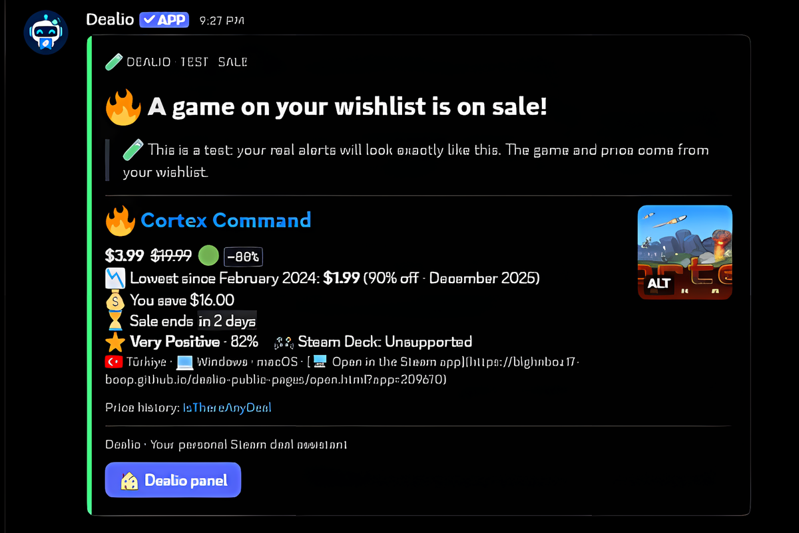
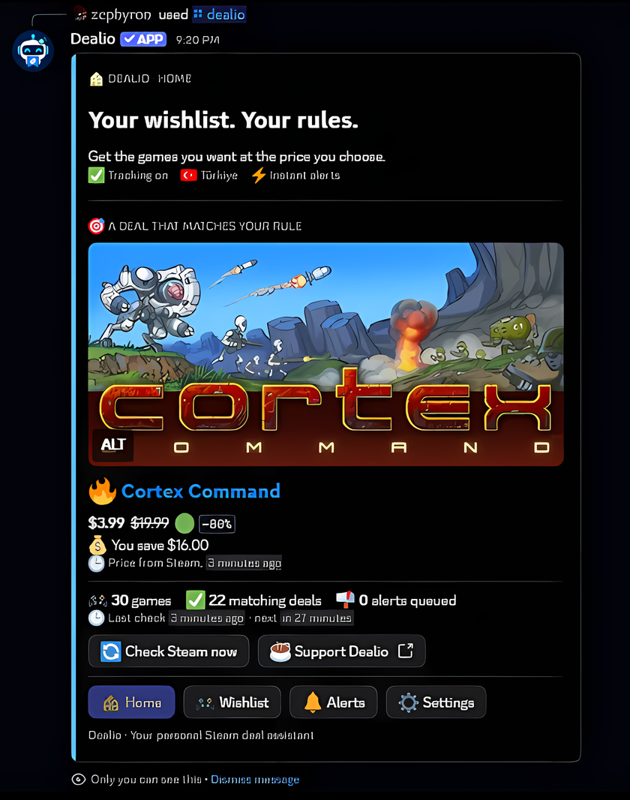
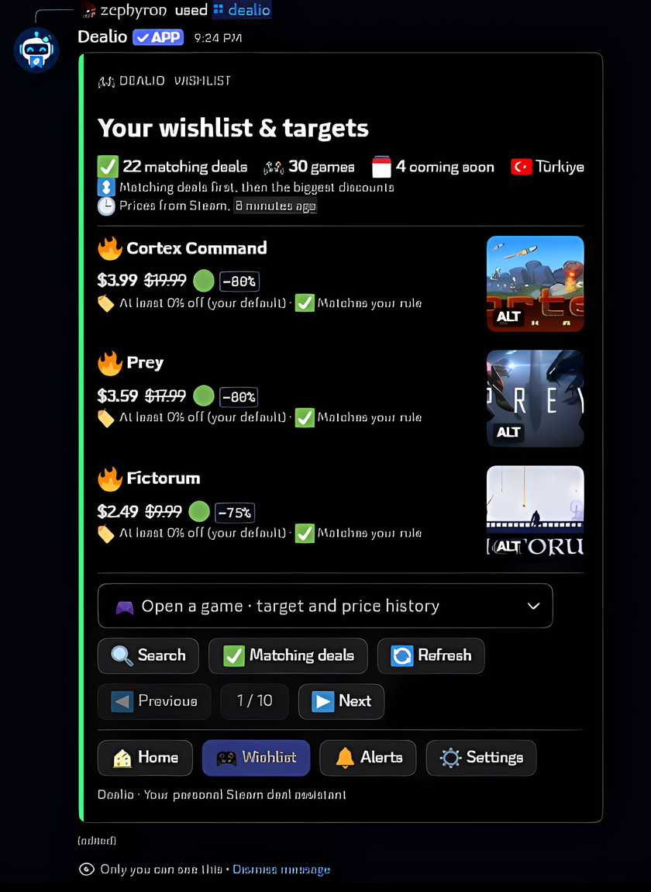
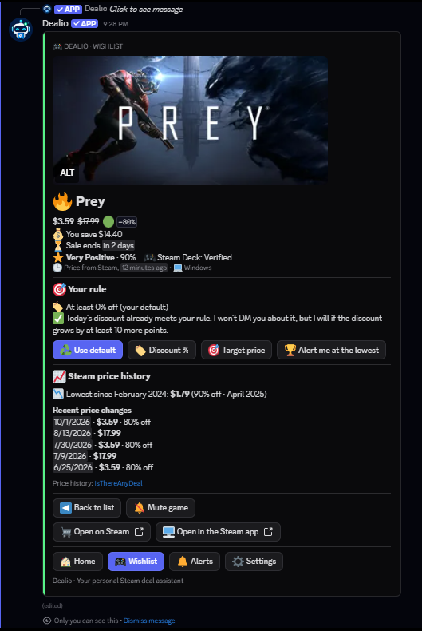

  

<h1 align="center">🎮 Senin Wishlist’in. Senin kuralların.</h1>

  Discord’daki kişisel Steam fiyat asistanın. 
  Fiyatını seç. Bildirim zamanını belirle. Gerisini Dealio takip etsin.

  <a href="README.md">English</a> · <strong>Türkçe</strong>

  
  
  

  
  
  
  

---

## 🎮 Daha az kontrol. Daha çok oyun.

Wishlist’ine bir oyun ekledin ama şu anki fiyatı sana fazla geliyor. Dealio’ya hangi fiyatta haber almak istediğini söyle; Steam’i belirli aralıklarla kontrol edip koşulların oluştuğunda sana Discord’dan DM göndersin. Karar vermek için gereken her şey de o mesajda olsun.

Her oyun için ayrı hedef belirleyebilir ya da tüm listene tek bir indirim eşiği uygulayabilirsin. Gece bildirim istemiyorsan sessiz saatlerini seç. Listeye bakmak veya bir ayarı değiştirmek için `/dealio` yazman yeterli.

| 🎯 Senin fiyatın | 🔕 Senin zamanın | 📊 Fiyatın hikâyesi |
| :--- | :--- | :--- |
| Her oyun için hedef fiyat veya indirim eşiği belirle ya da Dealio en düşük fiyatı beklesin. Bildirim istemediğin oyunu sustur. | Tespit edilince bildirim al, kendi saat diliminde sessiz saatler seç veya günlük özete geç. | En düşük fiyatı, Steam incelemelerini, Steam Deck durumunu ve indirimin ne zaman bittiğini doğrudan bildirimde gör. |

## 👀 Discord’da nasıl görünüyor?

   
  <strong>📬 İndirim geldiğinde DM kutunda</strong> · fiyat, tasarruf, en düşük fiyat, incelemeler, Steam Deck ve indirimin bitişi

<table>
  <tr>
    <td width="33%" valign="top" align="center"><strong>🏠 Ana sayfa</strong> Kuralına uyan en iyi fırsat ve kısa bir durum özeti  </td>
    <td width="33%" valign="top" align="center"><strong>🎮 İstek listem</strong> Önce kuralına uyanlar, sonra en büyük indirimler  </td>
    <td width="33%" valign="top" align="center"><strong>🎯 Oyun detayı</strong> Kuralın, fiyat geçmişi ve tek dokunuşla en düşük fiyat hedefi  </td>
  </tr>
</table>

6 Ekim 2026 tarihli gerçek Discord ekranları; arayüz dili İngilizce, mağaza Türkiye. Gösterilen DM bir test bildirimidir ve gerçek bildirimle aynı düzeni kullanır. Fiyatlar Steam’den gelir ve zamanla değişir.

### ✨ İçeride neler var?

- 🏠 **Tek panel, dört sekme.** 🏠 Ana sayfa, 🎮 İstek listem, 🔔 Bildirimler ve ⚙️ Ayarlar tek bir `/dealio` mesajının içinde yer değiştirir.
- 🎮 **Listende kolayca gezin.** Önce kuralına uyan fırsatlar, sonra en büyük indirimler gelir. Oyun ara, filtrele, üçer oyunluk sayfalarda dolaş veya herhangi bir oyunu aç.
- 🎯 **Her oyuna ayrı karar ver.** Genel indirim eşiğini kullan, o oyuna özel bir yüzde seç, doğrudan fiyat yaz ya da **En düşüğe inince haber ver**’e basıp en düşük fiyatı hedefle. İlgilenmediğin oyunu sustur.
- 📈 **Fiyatın zamanla nasıl değiştiğine bak.** Bildirimler ve oyun detayı, mağaza bölgendeki Steam en düşük fiyatını gösterir (IsThereAnyDeal’dan, yalnızca aynı para biriminde, hiçbir zaman çevrilmeden); oyun detayında son fiyat değişiklikleri de yer alır.
- ⭐ **Steam’in kendi bilgileri.** İnceleme puanı, Steam Deck uyumluluğu, platformlar ve indirimin bitiş zamanı; Steam belirttiği sürece. %100 indirim, kütüphanende sonsuza dek kalacak ücretsiz oyun olarak gösterilir.
- 🗓️ **Her oyun için dürüst durum.** Henüz çıkmamış oyunlar çıkış tarihiyle 🗓️ *yakında* olarak, bölgende satılmayan (🚫) veya Steam’den kaldırılan (🗑️) oyunlar da olduğu gibi gösterilir; hiçbiri başarısız kontrol sayılmaz.
- 🖥️ **Doğrudan mağazaya.** Oyunu Steam sitesinde ya da doğrudan Steam uygulamasında aç.
- 🔔 **Bildirimler senin zamanında.** Tespit edilince, sessiz saatlerle ya da günlük özet olarak. Bekleyen bildirimler gönderilmeden önce yeniden kontrol edilir.
- 📬 **Bildirimini takip et.** Bekleyen ve gönderilen DM’leri gör; mesaj alamıyorsan test bildirimiyle kontrol et.
- 👤 **Baştan başlamadan hesap değiştir.** Steam hesabını ⚙️ Ayarlar’dan değiştir; genel indirim oranın, bildirim zamanlaman ve dilin aynı kalır.
- 🌍 **Türkçe, İngilizce, Almanca ya da Fransızca.** Kurulum, paneller ve bildirimler dört dilde; her dilde Steam’in kendi terimleriyle (ör. istek listesi).

## ✨ Son gelişmeler

> **9 Ekim 2026 · v1.0.0: herkese açık**
>
> Dealio artık herkesin kullanımına açık. Discord uygulamalarına ya da bir sunucuya ekle, `/setup` yaz; istek listeni izlemeye başlasın. Ücretsiz ve kaynak kodu MIT lisansıyla açık.

> **6 Ekim 2026 · v0.2.0: tek panel, daha zengin bildirimler**
>
> Her şey artık Ana sayfa, İstek listem, Bildirimler ve Ayarlar sekmeleriyle tek bir `/dealio` panelinde. İndirim bildirimleri ve oyun detayı, en düşük fiyatın yanında Steam inceleme puanını, Steam Deck durumunu, platformları ve indirimin ne zaman bittiğini gösteriyor. En düşük fiyatı tek dokunuşla hedef yapabilir, oyunu doğrudan Steam uygulamasında açabilir ve yakında çıkacak oyunları çıkış tarihleriyle görebilirsin. Kurulum artık dil seçimiyle başlıyor ve onaylamadan önce Steam adını ve avatarını gösteriyor. [v0.2.0 sürüm notları →](https://github.com/blghnboz17-boop/dealio-steam-deals-bot/releases/tag/v0.2.0)

> **4 Ekim 2026 · Hesap değiştirme ve daha sağlam bildirimler**
>
> Steam hesabını artık verilerini silmeden ⚙️ Ayarlar’dan değiştirebilirsin. Steam bir oyunu istek listenden kısa süreliğine düşürürse, oyun geri geldiğinde Dealio bunu yeni indirim saymıyor; böylece aynı indirim için ikinci DM gelmiyor. İndirim DM’lerinde artık yalnızca panel butonu var; isteğe bağlı destek bağlantısı ana panele taşındı.

## 🚀 Discord’da başla

Dealio ücretsiz. Bir Discord hesabı ve herkese açık bir Steam istek listesi yeterli.

1. **[Dealio’yu Discord’a ekle](https://discord.com/oauth2/authorize?client_id=1540325119690412172).** Her yerde kullanmak için *Uygulamalarıma Ekle*’yi seç ya da yönettiğin bir sunucuya ekle.
2. **`/setup` yaz.** Dilini seç; Steam profil bağlantını, özel URL adını veya SteamID64’ünü gir; gerçek Steam Store ülkeni doğrula, ardından indirim DM’lerini açıkça onayla.
3. **`/dealio` aç.** Wishlist’ini incele, bir oyun seç ve istediğin fiyatı belirle.

İstek listenin okunabilmesi için Steam profilin ve “Oyun ayrıntıları” herkese açık olmalı; Discord, bottan DM almana izin vermeli. Dealio Steam şifreni, çerezlerini veya giriş oturumunu istemez.

## 🔔 Bildirimler ne zaman gelir?

Dealio, her tarama bittikten **30 dakika sonra** ve Steam'in fiyatları her gün değiştirdiği Pasifik saatiyle 10:00'dan (Türkiye'de 20:00, kış saatinde 21:00) hemen sonra yeniden kontrol eder; indirimlerin çoğu o anda başlar. Kuralına uyan bir fiyat değişimi olduğunda, seçtiğin bildirim zamanına göre DM gönderir. Steam veya Discord’da sorun varsa gecikme olabilir.

İlk kurulum mevcut indirimlerin bir özetini gönderebilir; hepsi için ayrı yeni-indirim bildirimi oluşturmaz. Bir oyun kuralına zaten uyarken kural kaydetmek ya da genel indirim oranını değiştirmek de DM göndermez; o indirim belirgin şekilde iyileşirse (en az 10 puan daha fazla indirim ya da tutturulmuş hedefte %10 daha düşük fiyat) haber verir. Fiyatlar seçtiğin Steam mağazasının para birimindedir; satın alırken son fiyatı Steam’de kontrol et.

## 💬 Komutlar

| Komut | İşlev |
| :--- | :--- |
| `/dealio` | Panelin: 🏠 Ana sayfa, 🎮 İstek listem, 🔔 Bildirimler ve ⚙️ Ayarlar |
| `/setup` | Steam profilini bağla, tercihlerini belirle |
| `/delete-data` | Onayından sonra aktif hesap verilerini sil |

Geri kalan her şey `/dealio` panelinde: istek listende gezin ve ara, hedef koy ya da oyun sustur, bildirimlerin ne zaman geleceğini seç, Steam’de hemen kontrol et, deneme DM’i gönder; bölgeni, dilini ya da Steam hesabını ⚙️ Ayarlar’dan değiştir (orada *Verilerimi sil* butonu da var).

Paneller sana özeldir; düğmeler paneli açan kullanıcıya bağlıdır. Süre dolunca veya bot yeniden başlayınca yeni bir komut açarak devam edebilirsin.

## 🔒 Verilerin ve kontrolün

Dealio hesap kimliklerini, tercihlerini, oyun kurallarını, gözlemlenen wishlist fiyatlarını ve teslimat kayıtlarını tutar. Ayrıca 90 gün boyunca kullanım kayıtları (hangi komutu veya düğmeyi kullandığın; ne yazdığın değil) saklanır. Normal Discord mesajlarının içeriğini veya Steam giriş bilgilerini toplamaz.

Bildirim geçmişi son **30 günü** gösterir; fiyat gözlemleri **90 gün** tutulur. Aktif teslimat ve devam eden tekliflerin tekrarını önleyen kayıtlar daha uzun kalabilir. `/delete-data` aktif hesap kayıtlarını siler. Mevcut yedek kopyaları yeniden yazılmaz; ancak ayrı tutulan bir silme kaydı (Discord kimliğinin tek yönlü özeti, 35 gün saklanır) yedekten geri dönülse bile verilerinin geri gelmemesini sağlar.

[Gizlilik](https://blghnboz17-boop.github.io/dealio-public-pages/privacy-tr.html) · [Kullanım koşulları](https://blghnboz17-boop.github.io/dealio-public-pages/terms-tr.html) · [Yardım](https://blghnboz17-boop.github.io/dealio-public-pages/help-tr.html)

## ❓ Sık sorulanlar

<strong>“Failed” veya “Başarısız” hatası aldım. Ne yapabilirim?</strong>

Bu mesaj tek başına nedenini söylemez; yanlış bir şey yaptığın anlamına da gelmez. Steam fiyatlara yanıt verememiş, Discord işlemi tamamlayamamış veya Dealio tarafında bir sorun çıkmış olabilir. Varsa mesajdaki ayrıntı bize daha çok şey söyler.

Biraz bekleyip komutu bir kez daha dene; bekleme süresi gösteriliyorsa dolmasını bekle. Eski paneldeki düğme çalışmıyorsa `/dealio` ile yeni bir panel aç. Sorun devam ederse [yardım sayfasından](https://blghnboz17-boop.github.io/dealio-public-pages/help-tr.html) kullandığın komutu, yaklaşık saati ve hata metnini paylaş. Ekran görüntüsündeki kişisel bilgileri gizlemen yeterli; kurulumu hemen silip baştan yapmana gerek yok.

<strong>Bot çalışıyor ama DM gelmiyor. Neyi kontrol etmeliyim?</strong>

Önce `/dealio` → ⚙️ Ayarlar’daki **Test DM** ile bir örnek mesaj iste. O da gelmiyorsa botu engellemediğini ve Discord’un Dealio’dan DM almana izin verdiğini (uygulamalarına eklenmişse ya da ortak bir sunucu üzerinden) kontrol et. Takip DM engeli nedeniyle durdurulduysa ayarı düzelttikten sonra ⚙️ Ayarlar’da **Takibi sürdür**’e bas.

Test mesajı geliyor ama indirim bildirimi gelmiyorsa `/dealio` → ⚙️ Ayarlar içindeki bildirim durumuna, oyunun hedef fiyatına veya indirim eşiğine, susturma seçeneğine ve sessiz saat/günlük özet ayarlarına bak. Test DM’si mesaj alabileceğini gösterir; her oyunun o anda bildirim koşulunu karşıladığı anlamına gelmez.

<strong>Steam profilim bulundu ama wishlist’im açılmıyor. Neden?</strong>

Profil bağlantısının doğru olduğundan ve wishlist’inin dışarıdan görülebildiğinden emin ol. Bunu Steam hesabına giriş yapmadığın bir tarayıcı penceresinde kendi wishlist bağlantını açarak kontrol edebilirsin; profilin görünmesi tek başına yeterli olmayabilir.

Steam gizlilik ayarlarını değiştirdiysen biraz bekleyip yeniden dene. Liste dışarıdan açıldığı hâlde Dealio hâlâ okuyamıyorsa Steam geçici olarak yanıt vermiyor olabilir. Tekrar denediğinde de düzelmiyorsa [bize haber ver](https://blghnboz17-boop.github.io/dealio-public-pages/help-tr.html); Steam şifreni veya oturum bilgilerini paylaşma.

<strong>Hedef belirledim. Neden hemen DM gelmedi?</strong>

Kural kaydı başlangıç durumunu belirler. Zaten uygun olan teklif panelde gösterilir; fiyat %10 daha düşerse ya da hedefinin üstüne çıkıp yeniden inerse DM gelir. Oyunun kuralını, susturma durumunu ve bildirim zamanını kontrol et. Mağaza bölgenin para birimi değiştiyse hedefi yeniden kaydet; o zamana kadar genel indirim kuralın geçerli.

<strong>Bazı oyunlarda “yakında” veya “satılmıyor” yazıyor. Bir sorun mu var?</strong>

Hayır. Henüz çıkmamış bir oyunun fiyatı yoktur; Dealio bunun yerine çıkış tarihini gösterir ve oyun çıktığında fiyatını takip etmeye başlar. Bazı oyunlar her mağaza bölgesinde satılmaz, bazıları da Steam’den kaldırılmıştır; Dealio bunları da olduğu gibi gösterir. Hiçbiri başarısız kontrol veya bilinmeyen fiyat sayılmaz.

<strong>Başka bir Steam hesabına nasıl geçerim?</strong>

`/dealio` → ⚙️ Ayarlar → **Steam hesabını değiştir**’e bas. Kurulumdaki profil penceresinin aynısı açılır; Dealio yeni hesabı gösterir ve ancak onaylarsan değiştirir. Genel indirim oranın, bildirim zamanlaman ve dilin aynı kalır. Eski hesabındaki oyunlara koyduğun kurallar, hedefler ve bekleyen bildirimler taşınmaz; yeni listende zaten indirimde olan oyunlar için bildirim gelmez. Bunun için `/delete-data` gerekmez.

<strong>Kurulumumu silmeden bildirimleri durdurabilir miyim?</strong>

Evet. `/dealio` → ⚙️ Ayarlar’da **Takibi durdur**’a bas. Ayarların korunur; takip durmuşken de 🏠 Ana sayfadaki **Steam’de şimdi kontrol et** çalışır.

<strong>Aynı bildirim iki kez gelebilir mi?</strong>

Dealio gönderdiği bildirimi kaydeder ve aynı teklif için normal kontrollerde tekrar mesaj atmaz. Steam bir oyunu istek listenden kısa süreliğine düşürürse oyun bir süre indirim durumunu korur; geri geldiğinde yeni indirim sayılmaz. Yine de Discord mesajı kabul edip yanıtı kaybolursa yeniden deneme çift mesaj oluşturabilir. Böyle bir durum görürsen bildirebilirsin.

## 🛠️ Geliştirme ve işletim

TypeScript · discord.js Components V2 · `node:sqlite` · IsThereAnyDeal API · Azure VM

- [Geliştirme rehberi](docs/development.md) — ayrı test kurulumu, ayarlar ve kontroller
- [Mimari](docs/architecture.md) — fiyatlar, kurallar, teslimat ve veri
- [Mevcut işletim düzeni](deploy/FREE-OPERATIONS.tr.md) — ücretsiz yedek, alarm ve kurtarma
- [Yönetim paneli](docs/admin-panel.tr.md) — yalnızca SSH tüneliyle erişilen, sahibine özel web paneli
- [GitHub kontrolleri](https://github.com/blghnboz17-boop/dealio-steam-deals-bot/actions/workflows/ci.yml) — güncel doğrulamalar

Dealio Steam wishlist’lerine odaklanır. Ödeme sistemi, kullanıcılara açık bir web paneli, diğer mağazalar ve tahmini para birimi dönüşümü kapsam dışındadır.

<strong>🔔 Bildirimler adım adım nasıl çalışır?</strong>

 

**Kontroller 30 dakikalık düzende yapılır; Steam’den anlık olay akışı alınmaz.** Bir sonraki otomatik tarama, önceki tarama bittikten 30 dakika sonrasına; Steam'in Pasifik saatiyle 10:00'daki fiyat değişimi daha önce geliyorsa onun 2 dakika sonrasına planlanır. Steam veya Discord kesintileri gecikme yaratabilir.

| Adım | Ne olur? |
| :--- | :--- |
| Gözlemle | Seçtiğin ülke ve dil için Steam fiyatları alınır. Başarılı oyun fiyatı sorguları beş dakikalık ortak önbelleği kullanır; gerçek gözlem zamanı korunur. |
| Karşılaştır | Oyunun hedef fiyatı veya indirim kuralı değerlendirilir. Alınamayan fiyat, fırsat olarak yorumlanmaz. |
| Gerekirse beklet | Sessiz saatler, günlük özet veya teslimat tekrarları için uygun bildirimler kalıcı kuyrukta tutulur. |
| Doğrula ve ilet | Gönderim öncesi bekleyen fırsatların fiyatı tekrar kontrol edilir. Bittiği doğrulanan teklif gönderilmez. |

Kurulum başlangıç durumunu kaydeder ve ayrıca bir wishlist özeti gönderebilir. Zaten indirimdeki her oyun için ayrı yeni-indirim bildirimi oluşturmaz. Mevcut fiyatın zaten karşıladığı bir hedefi kaydetmek de başlangıç bildirimi üretmez.

Fiyatlar Steam’in bildirdiği para biriminde kalır; tahmini kur dönüşümü yapılmaz. Hedef fiyat para birimine bağlıdır; ülke/para birimi değişince yeni hedef gerekebilir. En düşük fiyatlar IsThereAnyDeal’dan gelir; bu servis yanıt vermezse o satır yalnızca gösterilmez, bildirim hiçbir zaman gecikmez. Satın almadan önce Steam’deki ödeme fiyatını doğrula.

---

  <a href="https://github.com/blghnboz17-boop">Bilgehan</a> tarafından geliştiriliyor. 💙 · <a href="LICENSE">MIT lisansı</a> 
  Dealio bağımsız bir projedir; Valve, Discord veya IsThereAnyDeal ile bağlantılı değildir.

